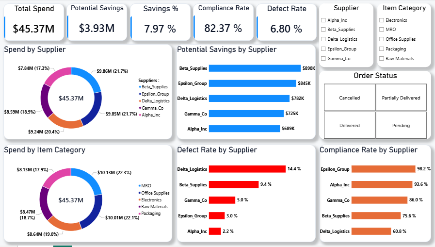

# Procurement Spend & Supplier Performance Analysis

A procurement analytics project focused on analyzing purchasing spend, supplier performance, savings, quality, compliance, and delivery performance using Excel and Power BI.

## Project Overview

This project analyzes procurement data to evaluate spending patterns, supplier performance, negotiated savings, product quality, compliance, and delivery performance.

The analysis focuses on identifying procurement risks, supplier performance gaps, and opportunities for better purchasing decisions.

## Dataset

The dataset contains 777 purchase orders covering procurement transactions across multiple suppliers and item categories.

Key fields include:

- Purchase Order ID
- Supplier
- Order Date
- Delivery Date
- Item Category
- Order Status
- Quantity
- Unit Price
- Negotiated Price
- Defective Units
- Compliance

## Objectives

The analysis aims to:

- Measure total procurement spend and negotiated savings.
- Evaluate supplier performance across cost, quality, compliance, and delivery.
- Identify suppliers requiring performance review.
- Analyze defect rates and quality issues.
- Assess order status and outstanding procurement exposure.
- Identify opportunities to improve procurement decisions through data-driven insights.

## Key KPIs

| KPI | Result |
|---|---:|
| Total Procurement Spend | $45.37M |
| Potential Spend | $49.30M |
| Potential Savings | $3.93M |
| Savings Rate | 7.97% |
| Reported Defect Rate | 6.80% |
| Compliance Rate | 82.37% |
| Purchase Orders | 777 |

## Tools & Technologies

- **Excel** — Data cleaning, validation, and preparation
- **Power BI** — Data modeling, DAX measures, analysis, and dashboard development
- **DAX** — Procurement KPI calculations and performance metrics

## Key Insights

- **Delta Logistics** shows the highest reported defect rate at **14.43%** and the lowest supplier compliance at approximately **60.82%**, making it a high-priority supplier for performance review.

- **Beta Supplies and Epsilon Group** account for approximately **43.44% of total procurement spend**, creating a significant level of supplier concentration.

- **Pending and Partially Delivered orders** represent approximately **20.66% of total procurement spend**, indicating a meaningful level of outstanding procurement exposure.

- The analysis identified **136 purchase orders with missing defective-unit data**, highlighting a data-quality gap that should be addressed in future procurement reporting.

- **MRO and Office Supplies** represent approximately **44.37% of total procurement spend**, making them the largest combined category spend.

- Overall potential savings were approximately **$3.93M**, representing a **7.97% savings rate** against the potential spend benchmark.

## Recommendations

Based on the analysis, the following actions are recommended:

- **Review Delta Logistics performance** through a supplier performance review focused on quality and compliance.
- **Investigate the root causes of defective units**, particularly for suppliers with consistently high defect rates.
- **Monitor outstanding orders** to reduce the financial exposure associated with Pending and Partially Delivered purchase orders.
- **Review supplier concentration** across high-spend suppliers and assess opportunities to improve supplier diversification where appropriate.
- **Improve data quality controls** for defective-unit reporting to ensure more reliable procurement quality KPIs.
- **Use negotiated savings alongside supplier quality and compliance metrics** when evaluating overall supplier performance.
